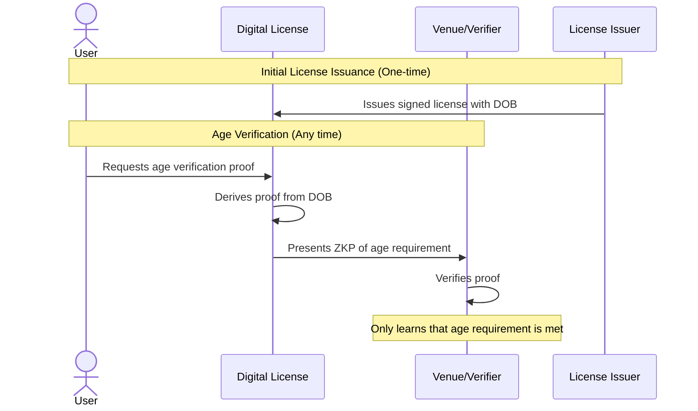

# Age Verification Use Case

*Parts of this document are created using Generative AI - there are known inaccuracies in this example that need to be resolved.*

## Overview

This use case demonstrates how queryable credentials can improve upon the current ISO mDL (mobile Driver's License) specification's approach to age verification. Instead of requiring pre-signed age threshold statements from the issuer, we can use the signed date of birth to derive age verification proofs on demand.

In the traditional ISO mDL approach:
- The issuer (e.g., DVLA) must pre-sign statements like "user_is_over_18"
- Users must request new signed statements for each age threshold
- Each request reveals to the issuer what age verification is being sought
- Increased load on issuer systems from repeated verification requests

With queryable credentials, we can:
- Use a single signed date of birth from the driving license
- Derive age verification proofs locally without contacting the issuer
- Maintain privacy by not revealing verification purposes to the issuer
- Reduce load on issuer systems
- Generate proofs for any age threshold without issuer involvement

## Flow Diagram



## Credential Examples

### 1. Digital Driver's License Credential

<details>
<summary>Click to expand Digital Driver's License Credential</summary>

```json
{
  "@context": [
    "https://www.w3.org/ns/credentials/v2",
    "https://www.w3.org/ns/credentials/examples/v2",
    "https://vocabulary.dvla.gov.uk/2024/credentials/v1"
  ],
  "id": "urn:uuid:a1b2c3d4-e5f6-7890-abcd-ef1234567890",
  "type": ["VerifiableCredential", "DigitalDriversLicense"],
  "issuer": {
    "id": "did:example:dvla123",
    "type": "Organization",
    "name": "Driver and Vehicle Licensing Agency"
  },
  "validFrom": "2024-01-15T00:00:00Z",
  "validUntil": "2034-01-14T23:59:59Z",
  "credentialSubject": {
    "id": "did:example:holder123",
    "type": "Person",
    "givenName": "Alice",
    "familyName": "Smith",
    "dateOfBirth": "2000-06-15",
    "licenseNumber": "SMITH906150A99AB",
    "licenseClass": ["B", "AM"],
    "issuingAuthority": "DVLA",
    "issuingCountry": "GB",
    "residentialAddress": {
      "type": "PostalAddress",
      "streetAddress": "123 Main St",
      "addressLocality": "London",
      "postalCode": "SW1A 1AA",
      "addressCountry": "GB"
    }
  }
}
```

</details>

### 2. Age Verification Request

<details>
<summary>Click to expand Age Verification Request</summary>

```json
{
  "@context": [
    "https://www.w3.org/ns/credentials/v2",
    "https://vocabulary.age-verification.org/2024/terms/v1"
  ],
  "type": "AgeVerificationRequest",
  "verifier": {
    "id": "did:example:venue123",
    "type": "Organization",
    "name": "Event Venue"
  },
  "requirements": {
    "minimumAge": 18,
    "verificationTime": "2024-03-16T20:00:00Z",
    "acceptedIssuers": [
      "did:example:dvla123",
      "did:example:eu-authority456"
    ],
    "acceptedCredentialTypes": [
      "DigitalDriversLicense",
      "NationalIDCard",
      "Passport"
    ]
  }
}
```

</details>

### 3. Age Verification Response

<details>
<summary>Click to expand Age Verification Response</summary>

```json
{
  "@context": [
    "https://www.w3.org/ns/credentials/v2",
    "https://vocabulary.age-verification.org/2024/terms/v1"
  ],
  "type": "AgeVerificationResponse",
  "verificationRequest": "request:age-verification-123",
  "holder": "did:example:holder123",
  "verifier": "did:example:venue123",
  "verificationTime": "2024-03-16T20:00:00Z",
  "result": {
    "meetsAgeRequirement": true,
    "minimumAgeVerified": 18
  },
  "proof": {
    "type": "ZeroKnowledgeProof",
    "verificationMethod": "did:example:holder123#key-1",
    "created": "2024-03-16T20:00:00Z",
    "proofPurpose": "To prove age requirement is met without revealing actual age",
    "proofValue": "z4r5TYU8iK...2nB4vM7xW9"
  }
}
```

</details>

## SPARQL Query for Age Verification

<details>
<summary>Click to expand SPARQL Query</summary>

```sparql
PREFIX rdf: <http://www.w3.org/1999/02/22-rdf-syntax-ns#>
PREFIX xsd: <http://www.w3.org/2001/XMLSchema#>
PREFIX dvla: <https://vocabulary.dvla.gov.uk/2024/terms/>
PREFIX av: <https://vocabulary.age-verification.org/2024/terms/>

SELECT ?meetsRequirement
WHERE {
  # Get the holder's date of birth from their credential
  ?credential dvla:dateOfBirth ?dob .
  
  # Get the verification requirements
  ?request av:minimumAge ?minAge ;
           av:verificationTime ?verificationTime .
  
  # Calculate age at verification time
  BIND(YEAR(?verificationTime) - YEAR(?dob) - 
    IF(MONTH(?verificationTime) < MONTH(?dob) || 
       (MONTH(?verificationTime) = MONTH(?dob) && DAY(?verificationTime) < DAY(?dob)),
    1, 0) AS ?age)
  
  # Check if age requirement is met
  BIND(?age >= ?minAge AS ?meetsRequirement)
  
  # Verify credential is from accepted issuer
  ?credential dvla:issuer ?issuer .
  ?request av:acceptedIssuers ?acceptedIssuer .
  FILTER(?issuer = ?acceptedIssuer)
  
  # Verify credential is not expired
  ?credential dvla:validUntil ?validUntil .
  FILTER(?validUntil > ?verificationTime)
}
```

The response would include a zero-knowledge proof attesting that:

1. The date of birth is from a valid, signed credential from an accepted issuer
2. The credential was not expired at the time of verification
3. The calculated age meets the minimum requirement
4. No actual date of birth or age is revealed to the verifier

</details>

### RDF 1.2 Data Representation

<details>
<summary>Click to expand RDF 1.2 Data Representation</summary>

```ttl
@prefix : <https://example.org/terms/> .
@prefix dvla: <https://vocabulary.dvla.gov.uk/2024/terms/> .
@prefix xsd: <http://www.w3.org/2001/XMLSchema#> .
@prefix holder: <did:example:holder123#> .

# DVLA's claims about the license holder
:DVLAAuthority :claims <<holder: dvla:dateOfBirth "2000-06-15"^^xsd:date>> .
:DVLAAuthority :claims <<holder: dvla:licenseNumber "SMITH906150A99AB">> .
:DVLAAuthority :claims <<holder: dvla:licenseClass "B">> .
:DVLAAuthority :claims <<holder: dvla:licenseClass "AM">> .

# Signature on the claims
:DVLAAuthority :signature _:sig1 .
_:sig1 :signatureValue "eyJhbGciOiJFUzI1..." .
_:sig1 :created "2024-01-15T00:00:00Z"^^xsd:dateTime .
_:sig1 :expires "2034-01-14T23:59:59Z"^^xsd:dateTime .

# Age verification request
:Venue :requests _:verification1 .
_:verification1 :minimumAge "18"^^xsd:integer .
_:verification1 :verificationTime "2024-03-16T20:00:00Z"^^xsd:dateTime .
_:verification1 :acceptedIssuer :DVLAAuthority .
```

This structure allows the creation of zero-knowledge proofs that demonstrate age requirements are met based on the signed date of birth, without revealing the actual date of birth or calculated age to the verifier.

</details>

## Comparison with ISO mDL Approach

| Feature                          | Current ISO mDL                                                | Queryable Credentials                                    |
| -------------------------------- | ------------------------------------------------------------- | ------------------------------------------------------ |
| Issuer dependency               | ❌ Requires issuer for each age threshold                     | ✅ One-time issuance of DOB                            |
| Privacy from issuer             | ❌ Issuer knows what ages are being verified                 | ✅ Issuer never learns verification purposes           |
| Flexibility                     | ❌ Limited to pre-defined age thresholds                     | ✅ Works with any age threshold                        |
| System load                     | ❌ High load from repeated verification requests             | ✅ No ongoing issuer involvement needed                |
| Offline verification            | ⚠️ Limited to pre-signed thresholds                        | ✅ Can verify any threshold offline                    |
| Selective disclosure            | ⚠️ May leak information about other age thresholds         | ✅ Only proves specific threshold requested            |
| Future compatibility            | ❌ Needs updates for new age thresholds                      | ✅ Automatically works with future requirements        |

This example demonstrates how queryable credentials can improve upon the current ISO mDL specification's approach to age verification. By using the signed date of birth with zero-knowledge proofs, we can provide more flexible, private, and efficient age verification while reducing the load on issuing authorities.

*Note*: Contents of this file, including examples were produced with the assistance of Generative AI. 