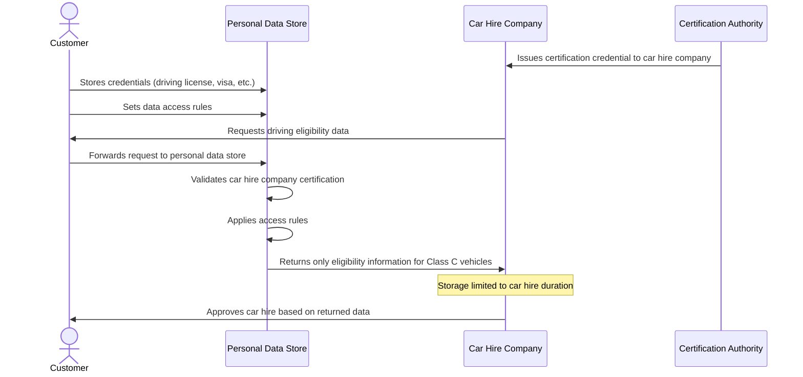

# Care Hire Use Case

## Overview

This use case describes how a care hire company can verify a customer's eligibility to drive a Class C vehicle in the UK without directly accessing sensitive personal documents.

In the traditional approach, the customer would need to provide multiple documents such as:

- Driving license
- License translation (if applicable)
- Visa status
- Criminal check history
- Passport

The car hire company would then need to use licensed software to:

- Determine which licenses are legally transferable to be used with Class C vehicles
- Check whether the customer has a valid visa status
- Verify whether the visa status allows the person to hire a car

Instead, with queryable credentials, the customer can have a rule in their personal data store that:

- Allows certified car hire companies to read only the data about which classes of car they are permitted to hire
- Ensures the company is obliged to hold that information only for the duration of the car hire

## Flow Diagram



## Credential Examples

### 1. Driving License Credential

<details>
<summary>Click to expand Driving License Credential</summary>

```json
{
  "@context": [
    "https://www.w3.org/ns/credentials/v2",
    "https://www.w3.org/ns/credentials/examples/v2",
    "https://vocabulary.dvla.gov.uk/2023/credentials/v1"
  ],
  "id": "urn:uuid:65924958-ff26-4e29-8acc-b3c8bcc115bc",
  "type": ["VerifiableCredential", "DrivingLicenseCredential"],
  "issuer": {
    "id": "https://dvla.gov.uk/issuers/42",
    "type": "Organization",
    "name": "Driver and Vehicle Licensing Agency"
  },
  "validFrom": "2021-04-15T00:00:00Z",
  "validUntil": "2031-04-14T23:59:59Z",
  "credentialSubject": {
    "id": "did:example:ebfeb1f712ebc6f1c276e12ec21",
    "type": "Person",
    "name": "Jane Doe",
    "birthDate": "1990-01-15",
    "drivingLicenseNumber": "DOEXX901151JAXXX",
    "vehicleCategories": [
      {
        "type": "VehicleCategory",
        "code": "B",
        "description": "Motor vehicles ≤ 3,500kg",
        "validFrom": "2021-04-15T00:00:00Z"
      },
      {
        "type": "VehicleCategory",
        "code": "C1",
        "description": "Medium-sized vehicles between 3,500kg and 7,500kg",
        "validFrom": "2021-04-15T00:00:00Z"
      }
    ],
    "residentialAddress": {
      "type": "PostalAddress",
      "streetAddress": "123 Main St",
      "addressLocality": "London",
      "postalCode": "SW1A 1AA",
      "addressCountry": "GB"
    }
  }
}
```
</details>

### 2. Visa Status Credential

<details>
<summary>Click to expand Visa Status Credential</summary>

```json
{
  "@context": [
    "https://www.w3.org/ns/credentials/v2",
    "https://www.w3.org/ns/credentials/examples/v2",
    "https://vocabulary.homeoffice.gov.uk/2023/credentials/v1"
  ],
  "id": "urn:uuid:5d80b7d7-8113-4522-9f61-a034f387ecc3",
  "type": ["VerifiableCredential", "VisaStatusCredential"],
  "issuer": {
    "id": "https://homeoffice.gov.uk/issuers/65",
    "type": "Organization",
    "name": "UK Home Office"
  },
  "validFrom": "2022-03-01T00:00:00Z",
  "validUntil": "2025-03-01T23:59:59Z",
  "credentialSubject": {
    "id": "did:example:ebfeb1f712ebc6f1c276e12ec21",
    "type": "Person",
    "visaType": "Tier 2 (General)",
    "visaNumber": "GBR23456789",
    "visaStatus": "Active",
    "entryPermission": {
      "type": "VisaPermission",
      "workPermitted": true,
      "studyPermitted": true,
      "vehicleHirePermitted": true
    },
    "visaIssuanceDate": "2022-03-01T00:00:00Z",
    "visaExpirationDate": "2025-03-01T23:59:59Z"
  }
}
```
</details>

### 3. Car Hire Company Certification Credential

<details>
<summary>Click to expand Car Hire Company Certification Credential</summary>

```json
{
  "@context": [
    "https://www.w3.org/ns/credentials/v2",
    "https://www.w3.org/ns/credentials/examples/v2",
    "https://vocabulary.bvrla.co.uk/2023/credentials/v1"
  ],
  "id": "urn:uuid:a8318e17-b096-4bcb-9456-fe8f1c01b3d4",
  "type": ["VerifiableCredential", "CarHireCompanyCertificationCredential"],
  "issuer": {
    "id": "https://bvrla.co.uk/issuers/12",
    "type": "Organization",
    "name": "British Vehicle Rental and Leasing Association"
  },
  "validFrom": "2023-01-01T00:00:00Z",
  "validUntil": "2024-01-01T23:59:59Z",
  "credentialSubject": {
    "id": "did:example:corporation:abc123",
    "type": "Organization",
    "name": "ExampleCar Rentals Ltd",
    "registrationNumber": "UK12345678",
    "certificationLevel": "Gold",
    "dataHandlingCommitments": {
      "type": "DataHandlingPolicy",
      "purposeLimitation": "Vehicle hire eligibility verification only",
      "retentionPolicy": "Duration of car hire only",
      "dataSharingRestrictions": "No third-party sharing without explicit consent"
    },
    "certificationAuditDate": "2022-12-15T00:00:00Z"
  }
}
```
</details>

### 4. Driving Eligibility Derived Credential

<details>
<summary>Click to expand Driving Eligibility Derived Credential</summary>

```json
{
  "@context": [
    "https://www.w3.org/ns/credentials/v2",
    "https://www.w3.org/ns/credentials/examples/v2",
    "https://vocabulary.carrentals.org/2023/credentials/v1"
  ],
  "id": "urn:uuid:f81d4fae-7dec-11d0-a765-00a0c91e6bf6",
  "type": ["VerifiableCredential", "DrivingEligibilityCredential"],
  "issuer": {
    "id": "did:example:ebfeb1f712ebc6f1c276e12ec21",
    "type": "Person"
  },
  "validFrom": "2023-05-10T00:00:00Z",
  "validUntil": "2023-05-17T23:59:59Z",
  "credentialSubject": {
    "id": "did:example:corporation:abc123",
    "type": "Organization",
    "eligibilityVerification": {
      "type": "DrivingEligibility",
      "eligibleVehicleClasses": ["B", "C1"],
      "eligibleInCountry": "GB",
      "visaStatusPermitsHire": true,
      "hireStartDate": "2023-05-10T09:00:00Z",
      "hireEndDate": "2023-05-17T17:00:00Z",
      "dataRetentionExpiry": "2023-05-17T23:59:59Z"
    }
  }
}
```
</details>

## Example Query

<details>
<summary>Click to expand Example Query</summary>

```json
{
  "@context": [
    "https://www.w3.org/ns/credentials/v2",
    "https://www.w3.org/ns/credentials/examples/v2"
  ],
  "type": "CredentialQuery",
  "credentialIssuer": "did:example:ebfeb1f712ebc6f1c276e12ec21",
  "credentialQuery": [
    {
      "type": ["DrivingEligibilityQuery"],
      "constraints": {
        "fields": [
          {
            "path": ["$.credentialSubject.eligibilityVerification.eligibleVehicleClasses"],
            "filter": {
              "type": "array",
              "contains": {
                "type": "string",
                "const": "C1"
              }
            }
          },
          {
            "path": ["$.credentialSubject.eligibilityVerification.eligibleInCountry"],
            "filter": {
              "type": "string",
              "const": "GB"
            }
          },
          {
            "path": ["$.credentialSubject.eligibilityVerification.visaStatusPermitsHire"],
            "filter": {
              "type": "boolean",
              "const": true
            }
          }
        ]
      },
      "queryRequester": {
        "id": "did:example:corporation:abc123",
        "type": "Organization",
        "certificationCredential": "urn:uuid:a8318e17-b096-4bcb-9456-fe8f1c01b3d4"
      },
      "intentToRetain": {
        "purpose": "vehicle hire eligibility verification",
        "maxRetentionPeriod": "P7D"
      }
    }
  ]
}
```
</details>

## Data Access Rules Example

<details>
<summary>Click to expand Data Access Rules Example</summary>

```json
{
  "@context": [
    "https://www.w3.org/ns/credentials/v2",
    "https://vocabulary.dataprotection.org/2023/rules/v1"
  ],
  "id": "rule:driving-eligibility-access-001",
  "type": ["AccessControlRule", "DataRetentionRule"],
  "controller": "did:example:ebfeb1f712ebc6f1c276e12ec21",
  "accessConditions": [
    {
      "type": "RequiredCredential",
      "credentialType": "CarHireCompanyCertificationCredential",
      "issuer": "https://bvrla.co.uk/issuers/12",
      "validAtTimeOfAccess": true
    }
  ],
  "permittedData": [
    {
      "dataType": "DrivingEligibility",
      "fields": [
        "eligibleVehicleClasses",
        "eligibleInCountry",
        "visaStatusPermitsHire"
      ]
    }
  ],
  "retentionLimit": {
    "type": "DynamicRetention",
    "limitedTo": "hireEndDate",
    "defaultMaximum": "P30D"
  },
  "purposeRestriction": "vehicle hire eligibility verification only",
  "auditRequirements": {
    "recordAccess": true,
    "notifyController": true
  }
}
```
</details>

This example demonstrates how queryable credentials can simplify the car hire process while protecting privacy and ensuring data minimization. The car hire company gets only the information it needs (ability to drive Class C vehicles in the UK), without handling or storing unnecessary sensitive personal documents.
