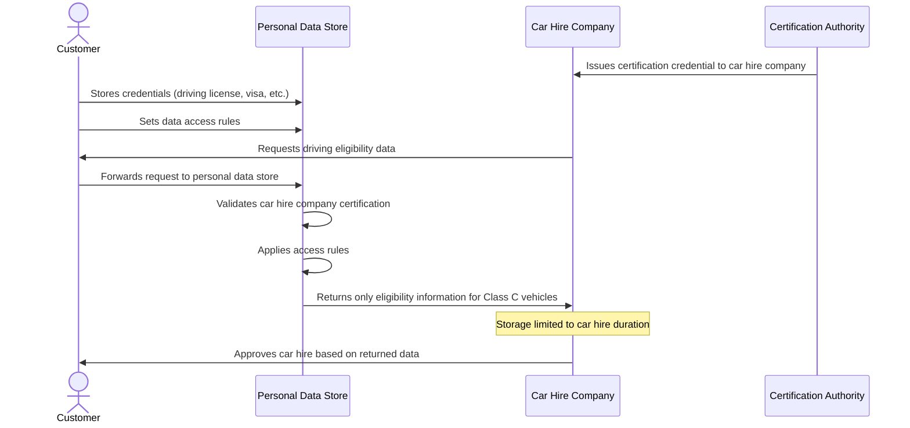

# Care Hire Use Case

## Overview

This use case describes how a care hire company can verify a customer's eligibility to drive a Class C vehicle in the UK without directly accessing sensitive personal documents.

In the traditional approach, the customer would need to provide multiple documents such as:

- Driving license
- License translation (if applicable)
- Visa status
- Criminal check history
- Passport

The car hire company would then need to use licensed software to:

- Determine which licenses are legally transferable to be used with Class C vehicles
- Check whether the customer has a valid visa status
- Verify whether the visa status allows the person to hire a car

Instead, with queryable credentials, the customer can have a rule in their personal data store that:

- Allows certified car hire companies to read only the data about which classes of car they are permitted to hire
- Ensures the company is obliged to hold that information only for the duration of the car hire

## Flow Diagram



## Credential Examples

### 1. Driving License Credential

<details>
<summary>Click to expand Driving License Credential</summary>

```json
{
  "@context": [
    "https://www.w3.org/ns/credentials/v2",
    "https://www.w3.org/ns/credentials/examples/v2",
    "https://vocabulary.dvla.gov.uk/2023/credentials/v1"
  ],
  "id": "urn:uuid:65924958-ff26-4e29-8acc-b3c8bcc115bc",
  "type": ["VerifiableCredential", "DrivingLicenseCredential"],
  "issuer": {
    "id": "https://dvla.gov.uk/issuers/42",
    "type": "Organization",
    "name": "Driver and Vehicle Licensing Agency"
  },
  "validFrom": "2021-04-15T00:00:00Z",
  "validUntil": "2031-04-14T23:59:59Z",
  "credentialSubject": {
    "id": "did:example:ebfeb1f712ebc6f1c276e12ec21",
    "type": "Person",
    "name": "Jane Doe",
    "birthDate": "1990-01-15",
    "drivingLicenseNumber": "DOEXX901151JAXXX",
    "vehicleCategories": [
      {
        "type": "VehicleCategory",
        "code": "B",
        "description": "Motor vehicles ≤ 3,500kg",
        "validFrom": "2021-04-15T00:00:00Z"
      },
      {
        "type": "VehicleCategory",
        "code": "C1",
        "description": "Medium-sized vehicles between 3,500kg and 7,500kg",
        "validFrom": "2021-04-15T00:00:00Z"
      }
    ],
    "residentialAddress": {
      "type": "PostalAddress",
      "streetAddress": "123 Main St",
      "addressLocality": "London",
      "postalCode": "SW1A 1AA",
      "addressCountry": "GB"
    }
  }
}
```

</details>

### 2. Visa Status Credential

<details>
<summary>Click to expand Visa Status Credential</summary>

```json
{
  "@context": [
    "https://www.w3.org/ns/credentials/v2",
    "https://www.w3.org/ns/credentials/examples/v2",
    "https://vocabulary.homeoffice.gov.uk/2023/credentials/v1"
  ],
  "id": "urn:uuid:5d80b7d7-8113-4522-9f61-a034f387ecc3",
  "type": ["VerifiableCredential", "VisaStatusCredential"],
  "issuer": {
    "id": "https://homeoffice.gov.uk/issuers/65",
    "type": "Organization",
    "name": "UK Home Office"
  },
  "validFrom": "2022-03-01T00:00:00Z",
  "validUntil": "2025-03-01T23:59:59Z",
  "credentialSubject": {
    "id": "did:example:ebfeb1f712ebc6f1c276e12ec21",
    "type": "Person",
    "visaType": "Tier 2 (General)",
    "visaNumber": "GBR23456789",
    "visaStatus": "Active",
    "entryPermission": {
      "type": "VisaPermission",
      "workPermitted": true,
      "studyPermitted": true,
      "vehicleHirePermitted": true
    },
    "visaIssuanceDate": "2022-03-01T00:00:00Z",
    "visaExpirationDate": "2025-03-01T23:59:59Z"
  }
}
```

</details>

### 3. Car Hire Company Certification Credential

<details>
<summary>Click to expand Car Hire Company Certification Credential</summary>

```json
{
  "@context": [
    "https://www.w3.org/ns/credentials/v2",
    "https://www.w3.org/ns/credentials/examples/v2",
    "https://vocabulary.bvrla.co.uk/2023/credentials/v1"
  ],
  "id": "urn:uuid:a8318e17-b096-4bcb-9456-fe8f1c01b3d4",
  "type": ["VerifiableCredential", "CarHireCompanyCertificationCredential"],
  "issuer": {
    "id": "https://bvrla.co.uk/issuers/12",
    "type": "Organization",
    "name": "British Vehicle Rental and Leasing Association"
  },
  "validFrom": "2023-01-01T00:00:00Z",
  "validUntil": "2024-01-01T23:59:59Z",
  "credentialSubject": {
    "id": "did:example:corporation:abc123",
    "type": "Organization",
    "name": "ExampleCar Rentals Ltd",
    "registrationNumber": "UK12345678",
    "certificationLevel": "Gold",
    "dataHandlingCommitments": {
      "type": "DataHandlingPolicy",
      "purposeLimitation": "Vehicle hire eligibility verification only",
      "retentionPolicy": "Duration of car hire only",
      "dataSharingRestrictions": "No third-party sharing without explicit consent"
    },
    "certificationAuditDate": "2022-12-15T00:00:00Z"
  }
}
```

</details>

### 4. Driving Eligibility Derived Credential

<details>
<summary>Click to expand Driving Eligibility Derived Credential</summary>

```json
{
  "@context": [
    "https://www.w3.org/ns/credentials/v2",
    "https://www.w3.org/ns/credentials/examples/v2",
    "https://vocabulary.carrentals.org/2023/credentials/v1"
  ],
  "id": "urn:uuid:f81d4fae-7dec-11d0-a765-00a0c91e6bf6",
  "type": ["VerifiableCredential", "DrivingEligibilityCredential"],
  "issuer": {
    "id": "did:example:ebfeb1f712ebc6f1c276e12ec21",
    "type": "Person"
  },
  "validFrom": "2023-05-10T00:00:00Z",
  "validUntil": "2023-05-17T23:59:59Z",
  "credentialSubject": {
    "id": "did:example:corporation:abc123",
    "type": "Organization",
    "eligibilityVerification": {
      "type": "DrivingEligibility",
      "eligibleVehicleClasses": ["B", "C1"],
      "eligibleInCountry": "GB",
      "visaStatusPermitsHire": true,
      "hireStartDate": "2023-05-10T09:00:00Z",
      "hireEndDate": "2023-05-17T17:00:00Z",
      "dataRetentionExpiry": "2023-05-17T23:59:59Z"
    }
  }
}
```

</details>

## Query Examples

### Current Approach: DCQL (Digital Credentials Query Language)

<details>
<summary>Click to expand DCQL Query Example</summary>

The following is an example of a DCQL query that car hire companies must use today with existing Verifiable Credentials systems. This approach only filters for existing credential structures and cannot perform derivations across different credentials:

```json
{
  "@context": [
    "https://www.w3.org/ns/credentials/v2",
    "https://www.w3.org/ns/credentials/examples/v2"
  ],
  "type": "CredentialQuery",
  "credentialIssuer": "did:example:ebfeb1f712ebc6f1c276e12ec21",
  "credentialQuery": [
    {
      "type": ["DrivingEligibilityQuery"],
      "constraints": {
        "fields": [
          {
            "path": ["$.credentialSubject.eligibilityVerification.eligibleVehicleClasses"],
            "filter": {
              "type": "array",
              "contains": {
                "type": "string",
                "const": "C1"
              }
            }
          },
          {
            "path": ["$.credentialSubject.eligibilityVerification.eligibleInCountry"],
            "filter": {
              "type": "string",
              "const": "GB"
            }
          },
          {
            "path": ["$.credentialSubject.eligibilityVerification.visaStatusPermitsHire"],
            "filter": {
              "type": "boolean",
              "const": true
            }
          }
        ]
      },
      "queryRequester": {
        "id": "did:example:corporation:abc123",
        "type": "Organization",
        "certificationCredential": "urn:uuid:a8318e17-b096-4bcb-9456-fe8f1c01b3d4"
      },
      "intentToRetain": {
        "purpose": "vehicle hire eligibility verification",
        "maxRetentionPeriod": "P7D"
      }
    }
  ]
}
```

</details>

### Proposed Approach: SPARQL with Zero-Knowledge Proof

<details>
<summary>Click to expand SPARQL Query Example</summary>

The following is an example of how a SPARQL query could be used with zero-knowledge proofs to query across multiple credentials and derive only the specific information needed (vehicle classes the customer can drive), without revealing any other personal information:

```sparql
PREFIX dvla: <https://vocabulary.dvla.gov.uk/2023/terms/>
PREFIX ho: <https://vocabulary.homeoffice.gov.uk/2023/terms/>
PREFIX vcard: <http://www.w3.org/2006/vcard/ns#>
PREFIX xsd: <http://www.w3.org/2001/XMLSchema#>
PREFIX cust: <did:example:ebfeb1f712ebc6f1c276e12ec21#>

SELECT ?vehicleClass ?description
WHERE {
  # Driving license information (issued by DVLA)
  cust: dvla:hasVehicleCategory ?category .
  ?category dvla:categoryCode ?vehicleClass ;
            dvla:categoryDescription ?description .
  
  # Visa status information (issued by Home Office)
  cust: ho:visaStatus "Active" .
  cust: ho:entryPermission ?permission .
  ?permission ho:vehicleHirePermitted true .
  
  # Only return class C vehicles
  FILTER(STRSTARTS(?vehicleClass, "C"))
}
```

The response would include only the list of Class C vehicles the customer is eligible to drive, with a zero-knowledge proof attesting that:

1. The driving license information is signed by a trusted authority (DVLA)
2. The visa information is signed by a trusted authority (UK Home Office)
3. The visa explicitly permits vehicle hire
4. The driving license includes the stated vehicle classes
5. No additional information from these credentials is disclosed

Example response structure:

```json
{
  "@context": [
    "https://www.w3.org/ns/credentials/v2",
    "https://www.w3.org/ns/credentials/examples/v2",
    "https://vocabulary.zkp.org/2023/terms/"
  ],
  "type": "QueryResponse",
  "results": [
    {
      "vehicleClass": "C1",
      "description": "Medium-sized vehicles between 3,500kg and 7,500kg"
    }
  ],
  "proof": {
    "type": "ZeroKnowledgeProof",
    "verificationMethod": "https://did.example.org/issuer#key-1",
    "created": "2023-05-10T12:00:00Z",
    "trustedIssuers": [
      "https://dvla.gov.uk/issuers/42",
      "https://homeoffice.gov.uk/issuers/65"
    ],
    "proofValue": "z3dCTC9bFs3Qd...Ah4B5NyyQ8KPM29"
  }
}
```

</details>

### RDF 1.2 Data Representation for Queryable Credentials

<details>
<summary>Click to expand RDF 1.2 Data Representation</summary>

The underlying RDF data structure that enables the SPARQL query uses RDF 1.2's ability to make statements about statements (reification). This allows properly attributing claims to their issuers:

```ttl
@prefix : <https://example.org/terms/> .
@prefix dvla: <https://vocabulary.dvla.gov.uk/2023/terms/> .
@prefix ho: <https://vocabulary.homeoffice.gov.uk/2023/terms/> .
@prefix xsd: <http://www.w3.org/2001/XMLSchema#> .
@prefix cust: <did:example:ebfeb1f712ebc6f1c276e12ec21#> .

# DVLA's claims about the customer's driving eligibility
:UKDrivingAuthority :claims <<cust: dvla:hasVehicleCategory _:cat1>> .
:UKDrivingAuthority :claims <<_:cat1 dvla:categoryCode "B">> .
:UKDrivingAuthority :claims <<_:cat1 dvla:categoryDescription "Motor vehicles ≤ 3,500kg">> .
:UKDrivingAuthority :claims <<_:cat1 dvla:validFrom "2021-04-15T00:00:00Z"^^xsd:dateTime>> .

:UKDrivingAuthority :claims <<cust: dvla:hasVehicleCategory _:cat2>> .
:UKDrivingAuthority :claims <<_:cat2 dvla:categoryCode "C1">> .
:UKDrivingAuthority :claims <<_:cat2 dvla:categoryDescription "Medium-sized vehicles between 3,500kg and 7,500kg">> .
:UKDrivingAuthority :claims <<_:cat2 dvla:validFrom "2021-04-15T00:00:00Z"^^xsd:dateTime>> .

# UK Home Office claims about visa status
:UKImmigrationAuthority :claims <<cust: ho:visaStatus "Active">> .
:UKImmigrationAuthority :claims <<cust: ho:entryPermission _:permission>> .
:UKImmigrationAuthority :claims <<_:permission ho:vehicleHirePermitted true>> .
:UKImmigrationAuthority :claims <<_:permission ho:workPermitted true>> .
:UKImmigrationAuthority :claims <<_:permission ho:studyPermitted true>> .

# Each set of claims has its own signature
:UKDrivingAuthority :signature _:sig1 .
_:sig1 :signatureValue "eyJhbGciOiJFUzI1..." .
_:sig1 :created "2021-04-15T00:00:00Z"^^xsd:dateTime .

:UKImmigrationAuthority :signature _:sig2 .
_:sig2 :signatureValue "eyJhbGciOiJFUzI1..." .
_:sig2 :created "2022-03-01T00:00:00Z"^^xsd:dateTime .
```

This structure allows zero-knowledge proofs to attest that query results are derived solely from signed facts, without revealing the actual triples used.

</details>

## Data Access Rules Example

<details>
<summary>Click to expand Data Access Rules Example</summary>

```json
{
  "@context": [
    "https://www.w3.org/ns/credentials/v2",
    "https://vocabulary.dataprotection.org/2023/rules/v1"
  ],
  "id": "rule:driving-eligibility-access-001",
  "type": ["AccessControlRule", "DataRetentionRule"],
  "controller": "did:example:ebfeb1f712ebc6f1c276e12ec21",
  "accessConditions": [
    {
      "type": "RequiredCredential",
      "credentialType": "CarHireCompanyCertificationCredential",
      "issuer": "https://bvrla.co.uk/issuers/12",
      "validAtTimeOfAccess": true
    }
  ],
  "permittedData": [
    {
      "dataType": "DrivingEligibility",
      "fields": [
        "eligibleVehicleClasses",
        "eligibleInCountry",
        "visaStatusPermitsHire"
      ]
    }
  ],
  "retentionLimit": {
    "type": "DynamicRetention",
    "limitedTo": "hireEndDate",
    "defaultMaximum": "P30D"
  },
  "purposeRestriction": "vehicle hire eligibility verification only",
  "auditRequirements": {
    "recordAccess": true,
    "notifyController": true
  }
}
```

</details>

## Comparison of Approaches

| Feature                  | Current DCQL Approach                                                                                                         | Proposed SPARQL+ZKP Approach                       |
| ------------------------ | ----------------------------------------------------------------------------------------------------------------------------- | -------------------------------------------------- |
| Cross-credential queries | ❌ Limited to filtering individual credentials                                                                                | ✅ Can query across multiple credentials           |
| Derived facts            | ❌ Cannot derive new facts from credentials                                                                                   | ✅ Can derive conclusions from multiple facts      |
| Data minimization        | ⚠️ Reveals entire credential fields                                                                                         | ✅ Reveals only the exact data needed              |
| Privacy                  | ⚠️ Limited to credential-level selective disclosure                                                                         | ✅ True zero-knowledge proof of only what's needed |
| Range queries            | ❌ Requires issuer to issue range predicate such as is_over_18 (as is currently the case with the ISO mobile Drivers License) | ✅ Full support for filters and condition          |

This example demonstrates how queryable credentials with SPARQL and zero-knowledge proofs can significantly enhance privacy while providing exactly the information needed for the car hire process. The car hire company gets only the list of Class C vehicles the customer is eligible to drive, with cryptographic proof that this information is derived from trusted credentials, without revealing any underlying personal data.

*Note*: Contents of this file, including examples were produced with the assistance of Generative AI.
