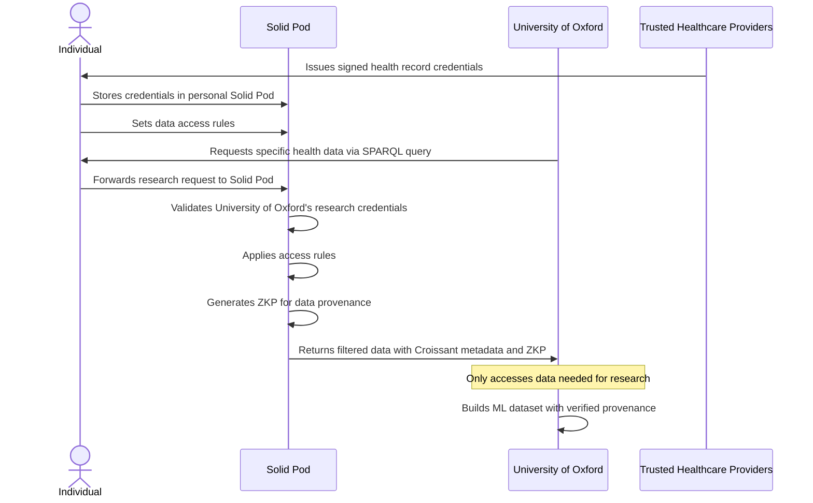

# Data Trust Use Case for Cancer Research

*Parts of this document are created using Generative AI - there are known inaccuracies in this example that need to be resolved.*

## Overview

This use case describes how the University of Oxford can collect and analyze cancer research data from individuals with personal health records stored in Solid Pods, without directly accessing sensitive personal information beyond what's necessary for their research.

In the traditional approach, researchers would need to:

- Collect personal health records directly from patients or healthcare providers
- Have patients sign extensive consent forms for all their data
- Store copies of sensitive personal data in research databases
- Manually verify the provenance and trustworthiness of the data
- Process and clean the data to make it suitable for machine learning

Instead, with queryable credentials, individuals can:

- Store their health records in their personal Solid Pods
- Have verifiable credentials from trusted health institutions such as the NHS, reputable GPs in the EU, UK, or Commonwealth countries
- Control which specific pieces of their data researchers can access
- Allow researchers to verify the provenance of the data without revealing unnecessary personal information

## Flow Diagram



## Credential Examples

### 1. Health Record Credential

<details>
<summary>Click to expand Health Record Credential</summary>

```json
{
  "@context": [
    "https://www.w3.org/ns/credentials/v2",
    "https://www.w3.org/ns/credentials/examples/v2",
    "https://vocabulary.nhs.uk/2023/credentials/v1"
  ],
  "id": "urn:uuid:65924958-ff26-4e29-8acc-b3c8bcc115bc",
  "type": ["VerifiableCredential", "HealthRecordCredential"],
  "issuer": {
    "id": "https://nhs.uk/issuers/42",
    "type": "Organization",
    "name": "National Health Service"
  },
  "validFrom": "2023-04-15T00:00:00Z",
  "validUntil": "2033-04-14T23:59:59Z",
  "credentialSubject": {
    "id": "did:example:ebfeb1f712ebc6f1c276e12ec21",
    "type": "Person",
    "name": "Jane Doe",
    "birthDate": "1990-01-15",
    "nhsNumber": "9000000009",
    "medicalConditions": [
      {
        "type": "MedicalCondition",
        "code": "C50.9",
        "description": "Malignant neoplasm of breast, unspecified",
        "diagnosisDate": "2022-06-15T00:00:00Z",
        "stage": "II",
        "treatmentPlan": "Surgery, Chemotherapy, Radiation"
      }
    ],
    "geneticInformation": {
      "type": "GeneticProfile",
      "brca1Status": "Positive",
      "brca2Status": "Negative",
      "testDate": "2022-05-10T00:00:00Z"
    },
    "residentialAddress": {
      "type": "PostalAddress",
      "streetAddress": "123 Main St",
      "addressLocality": "London",
      "postalCode": "SW1A 1AA",
      "addressCountry": "GB"
    }
  }
}
```

</details>

### 2. Research Institution Verification Credential

<details>
<summary>Click to expand Research Institution Verification Credential</summary>

```json
{
  "@context": [
    "https://www.w3.org/ns/credentials/v2",
    "https://www.w3.org/ns/credentials/examples/v2",
    "https://vocabulary.ukri.org/2023/credentials/v1"
  ],
  "id": "urn:uuid:5d80b7d7-8113-4522-9f61-a034f387ecc3",
  "type": ["VerifiableCredential", "ResearchInstitutionCredential"],
  "issuer": {
    "id": "https://ukri.org/issuers/65",
    "type": "Organization",
    "name": "UK Research and Innovation"
  },
  "validFrom": "2024-03-01T00:00:00Z",
  "validUntil": "2026-03-01T23:59:59Z",
  "credentialSubject": {
    "id": "did:example:university:oxford123",
    "type": "Organization",
    "name": "University of Oxford Medical Sciences Division",
    "registrationNumber": "UK98765432",
    "researchDomain": "Oncology",
    "ethicsCommitteeApproval": {
      "type": "ResearchApproval",
      "approvalNumber": "CUREC-2024-0123",
      "approvalDate": "2024-02-15T00:00:00Z",
      "expirationDate": "2026-02-15T23:59:59Z"
    },
    "dataProtectionCommitments": {
      "type": "DataHandlingPolicy",
      "purposeLimitation": "Cancer research only",
      "anonymizationRequired": true,
      "retentionPolicy": "5 years from research completion",
      "dataSharingRestrictions": "Anonymized results only with participant consent"
    }
  }
}
```

</details>

### 3. Data Access Consent Credential

<details>
<summary>Click to expand Data Access Consent Credential</summary>

```json
{
  "@context": [
    "https://www.w3.org/ns/credentials/v2",
    "https://www.w3.org/ns/credentials/examples/v2",
    "https://vocabulary.solid.community/2023/credentials/v1"
  ],
  "id": "urn:uuid:a8318e17-b096-4bcb-9456-fe8f1c01b3d4",
  "type": ["VerifiableCredential", "DataAccessConsentCredential"],
  "issuer": {
    "id": "did:example:ebfeb1f712ebc6f1c276e12ec21",
    "type": "Person",
    "name": "Jane Doe"
  },
  "validFrom": "2024-05-01T00:00:00Z",
  "validUntil": "2025-05-01T23:59:59Z",
  "credentialSubject": {
    "id": "did:example:university:oxford123",
    "type": "Organization",
    "accessGrant": {
      "type": "DataAccessGrant",
      "accessType": "ReadOnly",
      "purposeRestriction": "Breast cancer research only",
      "dataCategories": [
        "MedicalCondition",
        "GeneticProfile",
        "TreatmentOutcomes"
      ],
      "excludedFields": [
        "name",
        "birthDate",
        "nhsNumber",
        "residentialAddress"
      ],
      "startDate": "2024-05-01T00:00:00Z",
      "endDate": "2025-05-01T23:59:59Z",
      "revokePermitted": true
    }
  }
}
```

</details>

### 4. Research Data Derived Credential with Croissant Metadata

<details>
<summary>Click to expand Research Data Derived Credential with Croissant Metadata</summary>

```json
{
  "@context": [
    "https://www.w3.org/ns/credentials/v2",
    "https://www.w3.org/ns/credentials/examples/v2",
    "https://schema.org/",
    "https://mlcommons.org/croissant/",
    "https://vocabulary.cancer-research.org/2023/credentials/v1"
  ],
  "id": "urn:uuid:f81d4fae-7dec-11d0-a765-00a0c91e6bf6",
  "type": ["VerifiableCredential", "ResearchDataCredential"],
  "issuer": {
    "id": "did:example:ebfeb1f712ebc6f1c276e12ec21",
    "type": "Person"
  },
  "validFrom": "2024-05-10T00:00:00Z",
  "validUntil": "2026-05-10T23:59:59Z",
  "credentialSubject": {
    "id": "did:example:university:oxford123",
    "type": "Organization",
    "datasetVerification": {
      "type": "ResearchDataset",
      "@type": "sc:Dataset",
      "name": "Breast_Cancer_Genetic_Factors_2024",
      "description": "Dataset of breast cancer cases with genetic markers for research",
      "license": "https://creativecommons.org/licenses/by-nc/4.0/",
      "url": "https://example.com/dataset/breast-cancer-research",
      "keywords": ["breast cancer", "BRCA", "genetics", "treatment outcomes"],
      "creator": {
        "@type": "sc:Organization",
        "name": "University of Oxford Medical Sciences Division"
      },
      "distribution": [
        {
          "@type": "cr:FileObject",
          "@id": "breast_cancer_data.csv",
          "name": "breast_cancer_data.csv",
          "contentUrl": "data/breast_cancer_data.csv",
          "encodingFormat": "text/csv",
          "sha256": "48a7c257f3c90b2a3e529ddd2cca8f4f1bd8e49ed244ef53927649504ac55354"
        }
      ],
      "recordSet": [
        {
          "@type": "cr:RecordSet",
          "name": "cancer_records",
          "description": "Records of cancer diagnoses with genetic markers",
          "field": [
            {
              "@type": "cr:Field",
              "name": "condition_code",
              "description": "ICD-10 code for the cancer diagnosis",
              "dataType": "sc:Text",
              "references": {
                "fileObject": { "@id": "breast_cancer_data.csv" },
                "extract": {
                  "column": "condition_code"
                }
              }
            },
            {
              "@type": "cr:Field",
              "name": "stage",
              "description": "Cancer stage at diagnosis",
              "dataType": "sc:Text",
              "references": {
                "fileObject": { "@id": "breast_cancer_data.csv" },
                "extract": {
                  "column": "stage"
                }
              }
            },
            {
              "@type": "cr:Field",
              "name": "brca1_status",
              "description": "BRCA1 gene mutation status",
              "dataType": "sc:Text",
              "references": {
                "fileObject": { "@id": "breast_cancer_data.csv" },
                "extract": {
                  "column": "brca1_status"
                }
              }
            },
            {
              "@type": "cr:Field",
              "name": "brca2_status",
              "description": "BRCA2 gene mutation status",
              "dataType": "sc:Text",
              "references": {
                "fileObject": { "@id": "breast_cancer_data.csv" },
                "extract": {
                  "column": "brca2_status"
                }
              }
            },
            {
              "@type": "cr:Field",
              "name": "treatment_plan",
              "description": "Treatment plan assigned to patient",
              "dataType": "sc:Text",
              "references": {
                "fileObject": { "@id": "breast_cancer_data.csv" },
                "extract": {
                  "column": "treatment_plan"
                }
              }
            },
            {
              "@type": "cr:Field",
              "name": "treatment_outcome",
              "description": "Outcome of the treatment",
              "dataType": "sc:Text",
              "references": {
                "fileObject": { "@id": "breast_cancer_data.csv" },
                "extract": {
                  "column": "treatment_outcome"
                }
              }
            }
          ]
        }
      ],
      "dataProvenance": {
        "type": "DataProvenance",
        "trustedIssuers": [
          "https://nhs.uk/issuers/42",
          "https://healthcare.eu/issuers/93",
          "https://health.gov.au/issuers/27"
        ],
        "verificationMethod": "Zero-Knowledge Proof",
        "recordCount": 1582,
        "geographicScope": ["UK", "EU", "Australia", "Canada"],
        "timeframeStart": "2020-01-01T00:00:00Z",
        "timeframeEnd": "2024-04-30T23:59:59Z"
      }
    }
  },
  "proof": {
    "type": "ZeroKnowledgeProof",
    "verificationMethod": "https://did.example.org/issuer#key-1",
    "created": "2024-05-10T12:00:00Z",
    "proofValue": "z3dCTC9bFs3Qd...Ah4B5NyyQ8KPM29"
  }
}
```

</details>

## Query Examples

### Current Approach: DCQL (Digital Credentials Query Language)

<details>
<summary>Click to expand DCQL Query Example</summary>

The following is an example of a DCQL query that research institutions must use today with existing Verifiable Credentials systems. This approach only filters for existing credential structures and cannot perform derivations across different credentials:

```json
{
  "@context": [
    "https://www.w3.org/ns/credentials/v2",
    "https://www.w3.org/ns/credentials/examples/v2"
  ],
  "type": "CredentialQuery",
  "credentialIssuer": "did:example:ebfeb1f712ebc6f1c276e12ec21",
  "credentialQuery": [
    {
      "type": ["HealthRecordQuery"],
      "constraints": {
        "fields": [
          {
            "path": ["$.credentialSubject.medicalConditions[*].code"],
            "filter": {
              "type": "string",
              "const": "C50.9"
            }
          },
          {
            "path": ["$.credentialSubject.medicalConditions[*].stage"],
            "filter": {
              "type": "string",
              "const": "II"
            }
          },
          {
            "path": ["$.credentialSubject.geneticInformation.brca1Status"],
            "filter": {
              "type": "string",
              "const": "Positive"
            }
          }
        ]
      },
      "queryRequester": {
        "id": "did:example:university:oxford123",
        "type": "Organization",
        "researchApproval": "CUREC-2024-0123"
      },
      "intentToRetain": {
        "purpose": "breast cancer research",
        "maxRetentionPeriod": "P5Y"
      }
    }
  ]
}
```

</details>

### Proposed Approach: SPARQL with Zero-Knowledge Proof

<details>
<summary>Click to expand SPARQL Query Example</summary>

The following is an example of how a SPARQL query could be used with zero-knowledge proofs to query across multiple patients' credentials and derive only the specific aggregate information needed for cancer research, without revealing any individual's personal information:

```sparql
PREFIX nhs: <https://vocabulary.nhs.uk/2023/terms/>
PREFIX rdf: <http://www.w3.org/1999/02/22-rdf-syntax-ns#>
PREFIX xsd: <http://www.w3.org/2001/XMLSchema#>

SELECT ?ageGroup ?conditionCode ?stage ?brca1Status ?brca2Status ?treatmentPlan (COUNT(?patient) as ?patientCount) (AVG(?survivalMonths) as ?avgSurvivalMonths)
WHERE {
  # Match across all patients in the network
  ?patient a nhs:Patient ;
           nhs:ageGroup ?ageGroup ;  # Use age groups instead of exact age for privacy
           nhs:hasMedicalCondition ?condition ;
           nhs:hasGeneticProfile ?geneticProfile .

  # Health record information (issued by trusted healthcare provider)
  ?condition nhs:conditionCode ?conditionCode ;
             nhs:stage ?stage ;
             nhs:treatmentPlan ?treatmentPlan ;
             nhs:diagnosisDate ?diagnosisDate ;
             nhs:treatmentOutcome ?treatmentOutcome .
  
  # Calculate survival months for those with outcome data
  OPTIONAL {
    ?condition nhs:outcomeDate ?outcomeDate .
    BIND(MONTHS(?diagnosisDate, ?outcomeDate) as ?survivalMonths)
  }
  
  # Genetic information (also issued by trusted healthcare provider)
  ?geneticProfile nhs:brca1Status ?brca1Status ;
                  nhs:brca2Status ?brca2Status .
  
  # Only return breast cancer cases with BRCA mutations
  FILTER(STRSTARTS(?conditionCode, "C50"))
  FILTER(?brca1Status = "Positive" || ?brca2Status = "Positive")
  
  # Only from trusted healthcare providers (this constraint is enforced by the ZKP)
  # The trust verification happens during proof generation without revealing which specific records were used
}
GROUP BY ?ageGroup ?conditionCode ?stage ?brca1Status ?brca2Status ?treatmentPlan
HAVING (COUNT(?patient) >= 5)  # Privacy threshold to prevent identification of rare cases
ORDER BY ?ageGroup ?conditionCode ?stage
```

The response would include only aggregate data across multiple patients, with a zero-knowledge proof attesting that:

1. All health record information is signed by trusted healthcare authorities (NHS, EU healthcare providers, etc.)
2. All genetic information is signed by trusted healthcare authorities
3. All records match the specified criteria (breast cancer diagnosis with positive BRCA mutation)
4. No personally identifiable information like name, birth date, or address is disclosed
5. The data meets minimum group sizes to prevent re-identification
6. The data is from the claimed time period and geographic regions

Example response structure with Croissant metadata:

```json
{
  "@context": [
    "https://www.w3.org/ns/credentials/v2",
    "https://www.w3.org/ns/credentials/examples/v2",
    "https://schema.org/",
    "https://mlcommons.org/croissant/",
    "https://vocabulary.zkp.org/2023/terms/"
  ],
  "type": "QueryResponse",
  "@type": "sc:Dataset",
  "name": "Aggregated_Breast_Cancer_Genetic_Factors_2024",
  "description": "Aggregated dataset of breast cancer cases with genetic markers across multiple patients",
  "license": "https://creativecommons.org/licenses/by-nc/4.0/",
  "distribution": [
    {
      "@type": "cr:FileObject",
      "@id": "aggregated_breast_cancer_data.csv",
      "contentUrl": "data/aggregated_breast_cancer_data.csv",
      "encodingFormat": "text/csv"
    }
  ],
  "recordSet": [
    {
      "@type": "cr:RecordSet",
      "name": "aggregated_cancer_records",
      "field": [
        {"@type": "cr:Field", "name": "ageGroup", "description": "Age group of patients (in decades)", "dataType": "sc:Text"},
        {"@type": "cr:Field", "name": "conditionCode", "description": "ICD-10 code for the cancer diagnosis", "dataType": "sc:Text"},
        {"@type": "cr:Field", "name": "stage", "description": "Cancer stage at diagnosis", "dataType": "sc:Text"},
        {"@type": "cr:Field", "name": "brca1Status", "description": "BRCA1 gene mutation status", "dataType": "sc:Text"},
        {"@type": "cr:Field", "name": "brca2Status", "description": "BRCA2 gene mutation status", "dataType": "sc:Text"},
        {"@type": "cr:Field", "name": "treatmentPlan", "description": "Treatment plan assigned to patients", "dataType": "sc:Text"},
        {"@type": "cr:Field", "name": "patientCount", "description": "Number of patients in this group", "dataType": "sc:Integer"},
        {"@type": "cr:Field", "name": "avgSurvivalMonths", "description": "Average survival months for this group", "dataType": "sc:Float"}
      ]
    }
  ],
  "results": [
    {
      "ageGroup": "30-39",
      "conditionCode": "C50.9",
      "stage": "II",
      "brca1Status": "Positive",
      "brca2Status": "Negative",
      "treatmentPlan": "Surgery, Chemotherapy, Radiation",
      "patientCount": 28,
      "avgSurvivalMonths": 42.5
    },
    {
      "ageGroup": "40-49",
      "conditionCode": "C50.4",
      "stage": "III",
      "brca1Status": "Negative",
      "brca2Status": "Positive",
      "treatmentPlan": "Chemotherapy, Surgery, Targeted Therapy",
      "patientCount": 36,
      "avgSurvivalMonths": 38.2
    },
    {
      "ageGroup": "50-59",
      "conditionCode": "C50.9",
      "stage": "I",
      "brca1Status": "Positive",
      "brca2Status": "Negative",
      "treatmentPlan": "Surgery, Radiation",
      "patientCount": 45,
      "avgSurvivalMonths": 56.7
    }
    // Additional aggregated results...
  ],
  "dataProvenance": {
    "recordCount": 1582,
    "uniquePatientCount": 1582,
    "aggregationMethod": "Statistical grouping with minimum threshold of 5 patients per group",
    "trustedIssuers": [
      "https://nhs.uk/issuers/42",
      "https://healthcare.eu/issuers/93",
      "https://health.gov.au/issuers/27"
    ],
    "timeframeStart": "2020-01-01T00:00:00Z",
    "timeframeEnd": "2024-04-30T23:59:59Z",
    "geographicScope": ["UK", "EU", "Australia", "Canada"]
  },
  "proof": {
    "type": "ZeroKnowledgeProof",
    "verificationMethod": "https://did.example.org/issuer#key-1",
    "created": "2024-05-10T12:00:00Z",
    "proofPurpose": "To verify that all aggregated data comes from trusted healthcare providers without revealing individual patient data",
    "proofValue": "z3dCTC9bFs3Qd...Ah4B5NyyQ8KPM29"
  }
}
```

</details>

### RDF 1.2 Data Representation for Queryable Credentials

<details>
<summary>Click to expand RDF 1.2 Data Representation</summary>

The underlying RDF data structure that enables the SPARQL query uses RDF 1.2's ability to make statements about statements (reification). This allows properly attributing claims to their issuers:

```ttl
@prefix : <https://example.org/terms/> .
@prefix nhs: <https://vocabulary.nhs.uk/2023/terms/> .
@prefix xsd: <http://www.w3.org/2001/XMLSchema#> .
@prefix patient: <did:example:ebfeb1f712ebc6f1c276e12ec21#> .

# NHS's claims about the patient's health records
:NHSAuthority :claims <<patient: nhs:hasMedicalCondition _:condition1>> .
:NHSAuthority :claims <<_:condition1 nhs:conditionCode "C50.9">> .
:NHSAuthority :claims <<_:condition1 nhs:description "Malignant neoplasm of breast, unspecified">> .
:NHSAuthority :claims <<_:condition1 nhs:diagnosisDate "2022-06-15T00:00:00Z"^^xsd:dateTime>> .
:NHSAuthority :claims <<_:condition1 nhs:stage "II">> .
:NHSAuthority :claims <<_:condition1 nhs:treatmentPlan "Surgery, Chemotherapy, Radiation">> .
:NHSAuthority :claims <<_:condition1 nhs:treatmentOutcome "Remission">> .

# NHS's claims about the patient's genetic information
:NHSAuthority :claims <<patient: nhs:hasGeneticProfile _:genetic1>> .
:NHSAuthority :claims <<_:genetic1 nhs:brca1Status "Positive">> .
:NHSAuthority :claims <<_:genetic1 nhs:brca2Status "Negative">> .
:NHSAuthority :claims <<_:genetic1 nhs:testDate "2022-05-10T00:00:00Z"^^xsd:dateTime>> .

# EU Healthcare provider's claims about another patient
:EUHealthcareProvider :claims <<patient:2 nhs:hasMedicalCondition _:condition2>> .
:EUHealthcareProvider :claims <<_:condition2 nhs:conditionCode "C50.4">> .
:EUHealthcareProvider :claims <<_:condition2 nhs:description "Malignant neoplasm of upper-outer quadrant of breast">> .
:EUHealthcareProvider :claims <<_:condition2 nhs:diagnosisDate "2021-08-22T00:00:00Z"^^xsd:dateTime>> .
:EUHealthcareProvider :claims <<_:condition2 nhs:stage "III">> .
:EUHealthcareProvider :claims <<_:condition2 nhs:treatmentPlan "Chemotherapy, Surgery, Targeted Therapy">> .
:EUHealthcareProvider :claims <<_:condition2 nhs:treatmentOutcome "Partial Response">> .

:EUHealthcareProvider :claims <<patient:2 nhs:hasGeneticProfile _:genetic2>> .
:EUHealthcareProvider :claims <<_:genetic2 nhs:brca1Status "Negative">> .
:EUHealthcareProvider :claims <<_:genetic2 nhs:brca2Status "Positive">> .
:EUHealthcareProvider :claims <<_:genetic2 nhs:testDate "2021-07-15T00:00:00Z"^^xsd:dateTime>> .

# Each set of claims has its own signature
:NHSAuthority :signature _:sig1 .
_:sig1 :signatureValue "eyJhbGciOiJFUzI1..." .
_:sig1 :created "2022-06-15T00:00:00Z"^^xsd:dateTime .

:EUHealthcareProvider :signature _:sig2 .
_:sig2 :signatureValue "eyJhbGciOiJFUzI1..." .
_:sig2 :created "2021-08-22T00:00:00Z"^^xsd:dateTime .
```

This structure allows zero-knowledge proofs to attest that query results are derived solely from signed facts from trusted healthcare providers, without revealing the actual triples used or any personally identifiable information.

</details>

## Data Access Rules Example

<details>
<summary>Click to expand Data Access Rules Example</summary>

```json
{
  "@context": [
    "https://www.w3.org/ns/credentials/v2",
    "https://vocabulary.dataprotection.org/2023/rules/v1"
  ],
  "id": "rule:cancer-research-access-001",
  "type": ["AccessControlRule", "DataRetentionRule"],
  "controller": "did:example:ebfeb1f712ebc6f1c276e12ec21",
  "accessConditions": [
    {
      "type": "RequiredCredential",
      "credentialType": "ResearchInstitutionCredential",
      "issuer": "https://ukri.org/issuers/65",
      "validAtTimeOfAccess": true
    }
  ],
  "permittedData": [
    {
      "dataType": "MedicalCondition",
      "fields": [
        "conditionCode",
        "stage",
        "treatmentPlan",
        "treatmentOutcome"
      ]
    },
    {
      "dataType": "GeneticProfile",
      "fields": [
        "brca1Status",
        "brca2Status"
      ]
    }
  ],
  "excludedData": [
    {
      "dataType": "Person",
      "fields": [
        "name",
        "birthDate",
        "nhsNumber",
        "residentialAddress"
      ]
    }
  ],
  "retentionLimit": {
    "type": "FixedPeriod",
    "duration": "P5Y"
  },
  "purposeRestriction": "breast cancer research only",
  "auditRequirements": {
    "recordAccess": true,
    "notifyController": true,
    "provideResearchResults": true
  }
}
```

</details>

## Comparison of Approaches

| Feature                     | Current DCQL Approach                                                                                  | Proposed SPARQL+ZKP Approach                                         |
| --------------------------- | ------------------------------------------------------------------------------------------------------ | -------------------------------------------------------------------- |
| Cross-credential queries    | ❌ Limited to filtering individual credentials                                                         | ✅ Can query across multiple credentials                             |
| Derived facts               | ❌ Cannot derive new facts from credentials                                                            | ✅ Can derive conclusions from multiple facts                        |
| Data minimization           | ⚠️ Reveals entire credential fields                                                                  | ✅ Reveals only the exact data needed                                |
| Privacy                     | ⚠️ Limited to credential-level selective disclosure                                                  | ✅ True zero-knowledge proof of only what's needed                   |
| Standardized ML metadata    | ❌ No standard way to format results for ML                                                            | ✅ Results include Croissant metadata for immediate ML consumption   |
| Provenance verification     | ⚠️ Can only verify the provenance of individual credentials                                          | ✅ Can verify that all data came from trusted healthcare authorities |
| Interdisciplinary research  | ❌ Difficult to combine data from different domains                                                    | ✅ Can combine and query across various health-related domains       |
| Consent granularity         | ⚠️ Limited to predefined credential structures                                                       | ✅ Fine-grained consent through SPARQL pattern matching             |

This example demonstrates how queryable credentials with SPARQL and zero-knowledge proofs can significantly enhance privacy while providing exactly the information needed for cancer research. The University of Oxford gets only the specific cancer data they need for their research, with cryptographic proof that this information is derived from trusted healthcare providers, without revealing any underlying personal data.

*Note*: Contents of this file, including examples were produced with the assistance of Generative AI. 